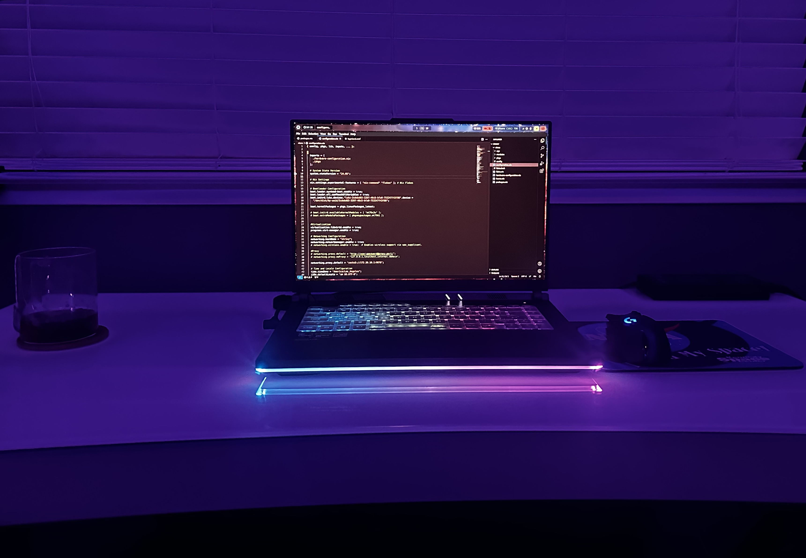

# dotfiles

<h1 align="center">
    
    
      My Dotfiles
    
        
   

  
  
  
  
  
 

</h1>

  
My personal dotfiles, free to the public in case anyone likes my setup!

    
  
| Component        | Version/Name                   |
| ---------------- | ------------------------------ |
| Distro           | NixOS                          |
| Shell            | Bash                           |
| Display Server   | Wayland                        |
| WM (Compositor)  | Hyprland                       |
| Bar              | Waybar                         |
| Launcher         | Wofi                           |
| Editor           | Helix                          |
| Terminal         | Kitty                          |
| Fetch Utility    | Fastfetch                      |
| Login Manager  | greetd                         |

